# Newsletter Email something

## Developing

### Install [Rust](https://www.rust-lang.org/tools/install)

Rust and its tooling are required to build this project. Installing via `rustup` does this all in one command.

### Install [mold](https://github.com/rui314/mold)

This project uses `mold` as the linker. You may disable this by modifying the `.cargo/config.toml` file.
NOTE(aalhendi): Eventually, Rust will be using `lld` by [default](https://blog.rust-lang.org/2024/05/17/enabling-rust-lld-on-linux.html). At that point it might be worth considering removing this dependency in order to streamline the setup time for this project.

### Install [cargo-watch](https://crates.io/crates/cargo-watch)

`cargo-watch` speeds up the iteration speed by triggering commands whenever a file is changed.

### Install [cargo-llvm-cov](https://github.com/taiki-e/cargo-llvm-cov)

`cargo llvm-cov --all-features --workspace --lcov --output-path lcov.info` computes code coverage for application code, ignoring test functions.
`cargo llvm-cov report --html --output-dir coverage` generates an HTML report.

### Install [cargo-audit](https://crates.io/crates/cargo-audit)

Checks against [RustSec/advisory-db](https://github.com/RustSec/advisory-db) for any reported vunerabilities.

### Install [sqlx](https://crates.io/crates/sqlx-cli/)

```sh
cargo install --version="~0.8" sqlx-cli --no-default-features --features rustls,postgres
```

We run a prepare command to generate query metadata to support offline compile-time verification.
A check for this is automatically run within the CI pipeline.

```sh
cargo sqlx prepare --workspace
```

### Intall [PostgreSQL](https://www.postgresql.org/)

The DB of choice for this project.

### Install [Bunyan](https://crates.io/crates/bunyan)

```sh
cargo install --locked bunyan
```

## To Run The App

```sh
./scripts/init_db.sh
./scripts/init_redis.sh

TEST_LOG=true RUST_LOG=debug cargo run | bunyan
```

OpenTelemetry via OpenObserve is optionally supported under the feature `open-telemetry`. You will also need to have an instance of OpenObserve running locally. The simplest way would be to spin up a container instance.

```sh
docker run -v $PWD/logs:/logs -e ZO_DATA_DIR="/logs" -p 5080:5080 \
    -e ZO_ROOT_USER_EMAIL="root@example.com" -e ZO_ROOT_USER_PASSWORD="Complexpass#123" \
    public.ecr.aws/zinclabs/openobserve:v0.12.1
```

```sh
cargo run --features "open-observe"
```

## Building An Image

```sh
docker build --tag zero2prod --file Dockerfile .
```

### Notes

Since tests are run as part of a single binary, you may run into some problems with too many open files in Linux (default 1024).
There is a limit to the number of maximum number of open file descriptors (including sockets) for each process.

```sh
thread 'actix-rt:worker' panicked at
'Can not create Runtime: Os { code: 24, kind: Other, message: "Too many open files" }',
```

```sh
ulimit -n <number>
```

## CI/CD Pipeline

```mermaid
%%{init: {'theme': 'dark'}}%%
flowchart TD
    classDef jobStyle fill:#2d333b,stroke:#adbac7,stroke-width:2px;
    classDef triggerStyle fill:#3b434b,stroke:#adbac7,stroke-width:2px;
    classDef defaultStyle fill:#22272e,stroke:#768390,stroke-width:1px;

    subgraph Main["Main Workflow"]
        direction TB
        A[Push / Pull Request]:::triggerStyle --> B & C & D & E

        subgraph B[Test]
            direction TB
            B1[Setup Rust]:::defaultStyle --> B2[Install sqlx-cli]:::defaultStyle
            B2 --> B3[Setup Postgres]:::defaultStyle
            B3 --> B4[Migrate database]:::defaultStyle
            B4 --> B5[Check sqlx-data.json]:::defaultStyle
            B5 --> B6[Run tests]:::defaultStyle
        end

        subgraph C[Rustfmt]
            direction TB
            C1[Setup Rust]:::defaultStyle --> C2[Enforce formatting]:::defaultStyle
        end

        subgraph D[Clippy]
            direction TB
            D1[Setup Rust]:::defaultStyle --> D2[Linting]:::defaultStyle
        end

        subgraph E[Code coverage]
            direction TB
            E1[Setup Rust]:::defaultStyle --> E2[Setup Postgres]:::defaultStyle
            E2 --> E3[Migrate database]:::defaultStyle
            E3 --> E4[Generate code coverage]:::defaultStyle
            E4 --> E5[Generate report]:::defaultStyle
        end
    end

    subgraph Security["Security Audit"]
        direction TB
        F[Scheduled / Cargo.toml changes]:::triggerStyle --> G

        subgraph G[Security audit]
            direction TB
            G1[Setup Rust]:::defaultStyle --> G2[Install cargo-deny]:::defaultStyle
            G2 --> G3[Scan for vulnerabilities]:::defaultStyle
        end
    end

    B:::jobStyle
    C:::jobStyle
    D:::jobStyle
    E:::jobStyle
    G:::jobStyle

    style Main fill:#22272e,stroke:#adbac7,stroke-width:2px
    style Security fill:#22272e,stroke:#adbac7,stroke-width:2px
```


