# CI/CD Pipeline

Our continuous integration and deployment pipeline consists of several key workflows that ensure code quality and security.

## Main Workflow

Triggered on push and pull requests, this workflow runs the following jobs:

### Test Job

1. Sets up Rust environment
2. Installs sqlx-cli
3. Sets up PostgreSQL
4. Runs database migrations
5. Verifies sqlx-data.json
6. Executes test suite

### Rustfmt Job

1. Sets up Rust environment
2. Enforces consistent code formatting

### Clippy Job

1. Sets up Rust environment
2. Runs linting checks

### Code Coverage Job

1. Sets up Rust environment
2. Sets up PostgreSQL
3. Runs database migrations
4. Generates code coverage data
5. Produces coverage report

## Security Audit Workflow

This workflow runs on schedule and when Cargo.toml changes:

1. Sets up Rust environment
2. Installs cargo-deny
3. Scans for known vulnerabilities

## Pipeline Visualization

```mermaid
%%{init: {'theme': 'dark'}}%%
flowchart TD
    classDef jobStyle fill:#2d333b,stroke:#adbac7,stroke-width:2px;
    classDef triggerStyle fill:#3b434b,stroke:#adbac7,stroke-width:2px;
    classDef defaultStyle fill:#22272e,stroke:#768390,stroke-width:1px;

    subgraph Main["Main Workflow"]
        direction TB
        A[Push / Pull Request]:::triggerStyle --> B & C & D & E

        subgraph B[Test]
            direction TB
            B1[Setup Rust]:::defaultStyle --> B2[Install sqlx-cli]:::defaultStyle
            B2 --> B3[Setup Postgres]:::defaultStyle
            B3 --> B4[Migrate database]:::defaultStyle
            B4 --> B5[Check sqlx-data.json]:::defaultStyle
            B5 --> B6[Run tests]:::defaultStyle
        end

        subgraph C[Rustfmt]
            direction TB
            C1[Setup Rust]:::defaultStyle --> C2[Enforce formatting]:::defaultStyle
        end

        subgraph D[Clippy]
            direction TB
            D1[Setup Rust]:::defaultStyle --> D2[Linting]:::defaultStyle
        end

        subgraph E[Code coverage]
            direction TB
            E1[Setup Rust]:::defaultStyle --> E2[Setup Postgres]:::defaultStyle
            E2 --> E3[Migrate database]:::defaultStyle
            E3 --> E4[Generate code coverage]:::defaultStyle
            E4 --> E5[Generate report]:::defaultStyle
        end
    end

    subgraph Security["Security Audit"]
        direction TB
        F[Scheduled / Cargo.toml changes]:::triggerStyle --> G

        subgraph G[Security audit]
            direction TB
            G1[Setup Rust]:::defaultStyle --> G2[Install cargo-deny]:::defaultStyle
            G2 --> G3[Scan for vulnerabilities]:::defaultStyle
        end
    end

    B:::jobStyle
    C:::jobStyle
    D:::jobStyle
    E:::jobStyle
    G:::jobStyle

    style Main fill:#22272e,stroke:#adbac7,stroke-width:2px
    style Security fill:#22272e,stroke:#adbac7,stroke-width:2px
```

